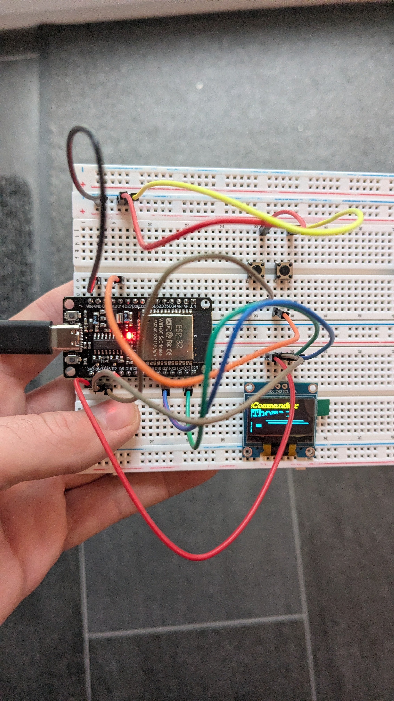
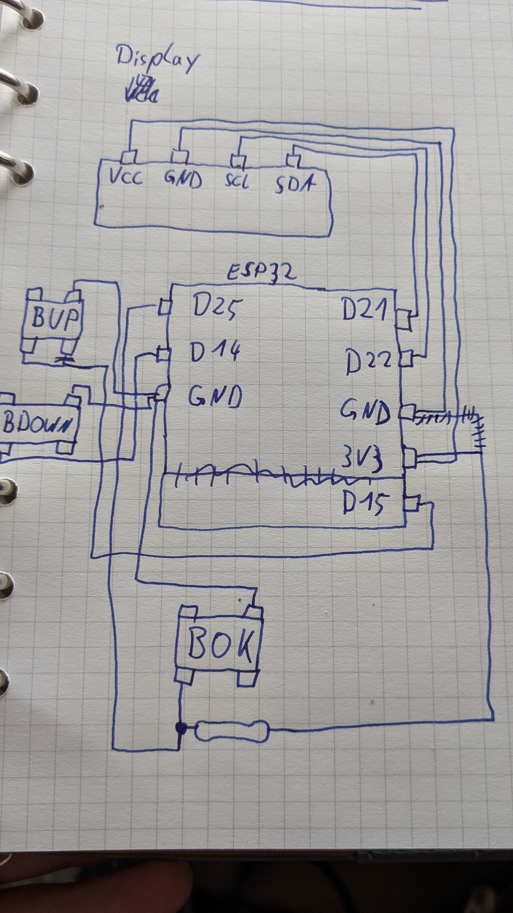
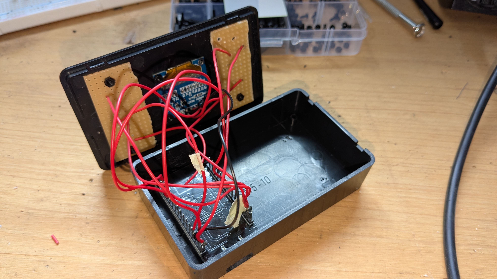
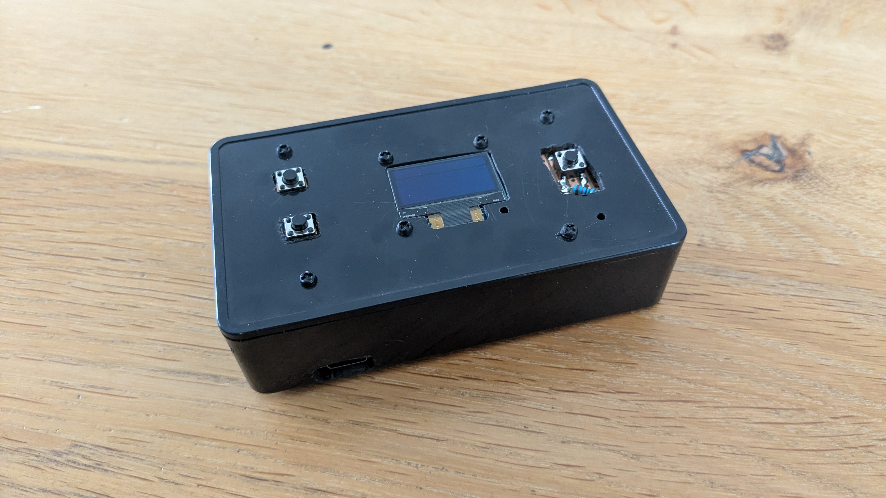

## Prerequisites
* esptool in venv
    ```
    python3 -m venv esptoolenv
    pip install esptool
    ```
* go1.25
  * https://go.dev/doc/install
* tinygo
* tinygo vscode plugin https://tinygo.org/docs/guides/ide-integration/vscode/

## Board
esp32 wroom 32d?

Connected to ESP32 on /dev/ttyUSB0:
Chip type:          ESP32-D0WD-V3 (revision v3.1)
Features:           Wi-Fi, BT, Dual Core + LP Core, 240MHz, Vref calibration in eFuse, Coding Scheme None
Crystal frequency:  40MHz

## Pins
GPIO 34-39 nur Input, kein Pullup
Bootstrapping Pins: 0, 2, 15
"sichere Pins" 4, 5, 18, 19, 21, 22, 23

Das hier scheint zu passen
https://docs.cirkitdesigner.com/component/c17b3fb8-cd90-4d82-bb00-6c98baabf4a9/esp32-wroom-32d-development-board

## Belegung für Buttons
Button1: D15/GPIO15
Button2: D14/GPIO14
Button3: D16/GPIO16


## Links
* https://tinygo.org/docs/tutorials/blinky/
* https://tinygo.org/docs/reference/microcontrollers/d1mini/
* Pins: https://makesmart.net/blog/read/esp8266-d1-mini-datenblatt-und-spezifikationen
* https://newbiely.com/tutorials/esp8266/esp8266-button-led
* https://newbiely.com/tutorials/esp8266/esp8266-button
* NeoPixel: https://tinygo.org/tour/ws2812/intro/
* sh1106 OLED Display
    * Treiber: https://pkg.go.dev/tinygo.org/x/drivers/sh1106
    * Github: https: //github.com/tinygo-org/drivers/tree/v0.35.0/sh1106
    * Anschluss: https://botland.de/blog/esp32-anschluss-eines-oled-displays/
    * über SPI: https://sourcegraph.com/r/github.com/tinygo-org/drivers/-/blob/examples/sh1106/macropad_spi/main.go
    * I2C Infos: https://done.land/components/humaninterface/display/oled/sh1106/
* tinyfont: 
* tinydraw:
* connect button with PullUp Resistor: https://espblockly.com/pullup.html


## Flash to device:

1. activate/deactivate venv. `esptool` will be available after activation
    ```
    source esptoolenv/bin/activate
    deactivate
    ```
2. Flash to device
    ```
    tinygo flash -target=esp32-coreboard-v2 -port=/dev/ttyUSB0
    ```
   or
    ```
    task flash
    ```
3. Monitor output
    ```
    task monitor
    ```

## Problem: /dev/ttyUSB0 not available
cause: device/driver overlap with D1mini board
https://askubuntu.com/questions/1403705/dev-ttyusb0-not-present-in-ubuntu-22-04

```
lsusb
usb-devices
```

## Problem: Could not write
```
A fatal error occurred: Could not open /dev/ttyUSB0, the port is busy or doesn't exist.                                                                                                                                    
([Errno 13] could not open port /dev/ttyUSB0: [Errno 13] Permission denied: '/dev/ttyUSB0')                                                                                                                                
                                                                                                                                                                                                                           
Hint: Try to add user into dialout or uucp group.
```
Solution: add user to `dialout` group
https://github.com/esp8266/source-code-examples/issues/26
Logout/login required afterwards

## Images





